<div align=center></div>


# WDScanner简介

随着互联网各种安全漏洞愈演愈烈，JAVA反序列化漏洞、STRUTS命令执行漏洞、ImageMagick命令执行漏洞等高危漏洞频繁爆发。在这种情况下，为了能在漏洞爆发后快速形成漏洞检测能力，同时能对网站或主机进行全面快速的安全检测，开发了一套简单易用的分布式web漏洞检测系统WDScanner。

WDScanner平台目前实现了如下功能：

**客户管理：添加客户、添加客户持有系统、设置客户持有系统的扫描策略、周期性扫描等**

**漏洞扫描：分布式web扫描、漏洞定期扫描、敏感信息泄露扫描、漏洞管理等**

**信息搜集：网站标题、banner、端口开放、子域名、CMS指纹、操作系统版本、开发语言、WAF、CDN、中间件等**

**网站爬虫：网站链接爬取、暗链检测、坏链检测、敏感字检测**

**其他功能：代理搜集、检索中心、导出报告**

****

# 声明

**本平台只是对目标系统进行信息搜集和端口开放性探测，漏洞扫描调用了wvs的扫描核心，主要是为了方便大家对目标系统进行安全检测并出具中文报告。**

**对互联网任何目标的检测均需在取得授权后方可进行，如需测试本平台可用性请自行搭建靶机环境。若使用者因此做出危害网络安全的行为后果自负，与作者无关，特此声明。**


# 更新说明

**v1.0版本：** 在2019年3月开源在github上，但之前没想到大家会对这个小平台关注度这么高，所以提供的安装方法也比较简陋，导致很多朋友在安装时遇到一些问题浪费了一些时间，在此表示歉意。

**v1.1版本：** 2019年5月，根据大家的反馈，重新打包了整个环境，提供了三种安装方式。由于里面有个别模块是对接的我们内网其他系统，所以这里就不再提供。

****

# 目录
* [Install](#Install)
* [Change_Log](#Change_Log)
* [Function](#Function)
    * [登录界面](#1、登录界面)
    * [分布式扫描](#2、分布式扫描)
    * [客户管理](#3、客户管理)
    * [信息收集](#4、网站信息收集)
    * [网站爬虫](#5、网站爬虫)
    * [专项检测](#6、专项检测)
    * [检索中心](#7、检索中心)
    * [代理资源池](#8、代理资源池)
    * [节点管理](#9、节点管理)
    * [报告输出](#10、报告输出)
* [ToDo](#ToDo)


# Install


**GitHub地址：`https://github.com/TideSec/WDScanner/`**


## 方式1：虚拟机环境

1、下载虚拟机镜像

```
链接: https://pan.baidu.com/s/1hcyL1S6AjKRh5fHerCCnJA 提取码: 8b44  解压密码www.tidesec.net

因为分享的单文件有点大，有时候就莫名其妙的下载无效了，及时联系我，我会更新下载链接。

```

打包好的vmware镜像，使用VMware Workstation 15 Pro制作，直接下载后解压，用vmware打开即可，理论上15.0以上版本都可以。

**在VMware Workstation 15及以上版本如果提示“导入失败”，提示“规范一致性和硬件合规性”检查什么的，直接点“重试”即可。**

```
提供一个VMware Workstation 15 Pro的下载地址：

链接: https://pan.baidu.com/s/1bvte1sM2U9_7IsNDWaJ_hQ 提取码: c2fs
```

虚拟机为win7系统，用户名TideSec，密码123456。虚拟机默认是nat模式联网，理论上可自动分配ip地址可直接使用。

另外，虚拟机为win7 sp1，没打任何补丁，ms17010什么的应该也有，如有必要请自行加固虚拟机。

2、运行桌面上的phpstudy，启动服务。

3、运行桌面上的`Tide-proxy-bat.bat`和`Tide-WDScanner-bat.bat`两个文件。

4、本机访问http://127.0.0.1 ，用户名密码为admin/123456， 登录即可，然后进行添加客户、添加任务、执行扫描等。


## 方式2：半集成安装

1、下载软件包

```
链接：https://pan.baidu.com/s/1ojKxbrDabLqtL4HDgjljlg  提取码：vb3h  解压密码www.tidesec.net
```
这里面打包好了phpstudy环境，把它解压到C盘根目录下，目录名不要变，即C:\WDScanner目录下。

2、安装python2.7、ruby、nmap、awvs10.5、pip等。

从安装包的wdscan-soft目录下安装相应软件，进行环境变量配置。

3、安装python依赖库

因为后台脚本都是使用的python来运行，所以调用了一些第三方库，在TaskPython目录下有个requirements.txt文件

在TaskPython目录下执行`pip install -r requirements.txt`即可。

4、在TaskPython目录下分别执行`Tide-proxy-bat.bat`和`Tide-WDScanner-bat.bat`两个文件，则分别开启了WDScanner后台任务和代理搜集任务。

5、本机访问http://127.0.0.1 ，用户名密码为admin/123456， 登录即可，然后进行添加客户、添加任务、执行扫描等。


## 方式3：手工安装

1、安装python2.7、ruby、nmap、awvs10.5、pip等。

建议使用windows环境，因为wvs当时只能运行在windows环境下（现在好像有了linux版），wvs建议使用wvs10.5版本。python和pip安装后配置好环境变量。

我把上面需要几个软件进行了打包，在`wdscan-soft`目录下，逐个安装即可，下载地址：
```
链接：https://pan.baidu.com/s/1ojKxbrDabLqtL4HDgjljlg  提取码：vb3h  解压密码www.tidesec.net
```

2、安装php运行环境

建议使用apache，php版本5.*不要太高，建议使用phpstudy，简单便捷，一键部署。

将所有文件放在c:\wdscanner\www目录下。因为有些偷懒，把一些路径写的绝对路径，如果自己有代码编辑能力，强烈建议自行二次开发。

3、安装python依赖库

因为后台脚本都是使用的python来运行，所以调用了一些第三方库，在TaskPython目录下有个requirements.txt文件

在TaskPython目录下执行`pip install -r requirements.txt`即可。

4、解压缩wdscanner.sql.zip，在mysql中新建数据库wdscan，将其中的wdscanner.sql导入，在include目录下的config.inc.php中修改数据库密码。

5、在扫描节点上运行TaskPython目录下的taskscan.py、taskspider.py、taskinfo.py即可分别进行任务扫描、网站爬取关键字分析、信息搜集等。（由于w3af配套部署比较麻烦，所以本版本未集成w3af）

6、执行TaskPython/proxy目录下的ip_pool.py、assess_quality.py可进行代理搜集及代理评分。

7、本机访问http://127.0.0.1 ，用户名密码为admin/123456， 登录即可，然后进行添加客户、添加任务、执行扫描等。


# Change_Log

- [2017-10-02] 实现了分布式扫描，可以多节点进行扫描
- [2017-09-25] 使用php做了个前端展示，不会美工，凑合着看
- [2017-08-12] 用python实现了漏洞扫描、爬虫、信息探测等


# Function

## 1、登录界面


项目大厅，配色比较恶俗

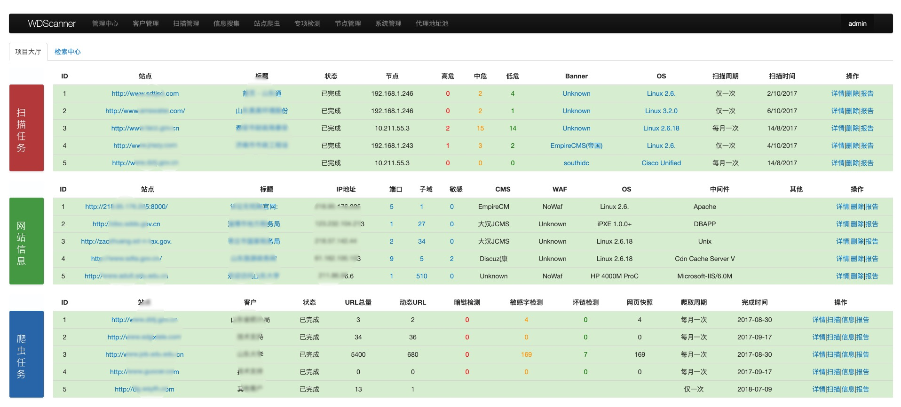

## 2、分布式扫描

WDScanner使用了分布式web漏洞扫描技术，前端服务器和用户进行交互并下发任务，可部署多个扫描节点服务器，能更快速的完成扫描任务。


因为wvs的结果是英文的，如果需要提供报告给客户的话友好度不高，所以对wvs的扫描结果、加固建议、漏洞描述等进行了汉化。

对wvs的汉化主要是爬取了wvs官方的漏洞库，对较为常见的漏洞进行了人工翻译，然后使用谷歌翻译对其他漏洞进行了翻译，人工进行了核对，最终大约包含670个漏洞。

汉化后的数据库可从这个表中获取，`https://github.com/TideSec/WDScanner`，在数据库文件的vul_cn表中。

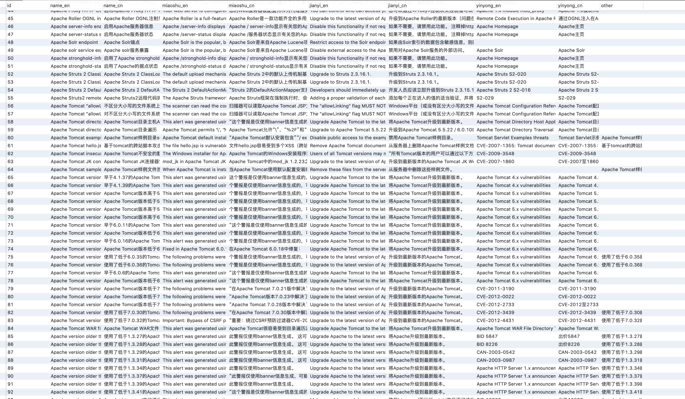

扫描核心库使用了secscanner+w3af+awvs三款工具（secscanner是在建的另一套web扫描器， w3af是最好的开源扫描器），使用较多的扫描工具可能导致扫描速度有所降低，但误报率也会大大降低，扫描时也可选择最实用的扫描策略以节省时间。

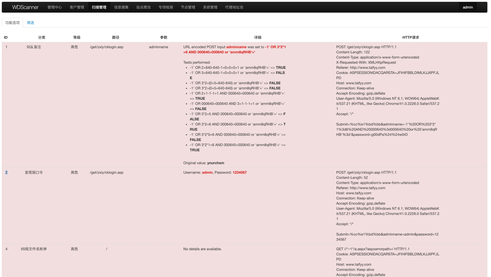

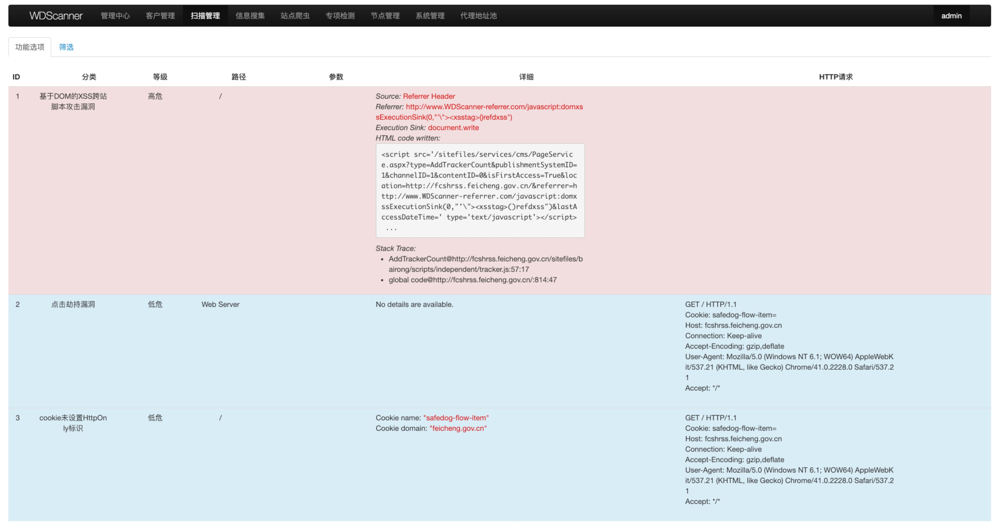


## 3、客户管理
能对客户和资产进行管理，根据客户需求定制化扫描和监测方案，对网站进行定期扫描和网站爬取，检索敏感字、坏链、暗链、信息泄露等威胁，发现风险能及时提醒并告知客户。

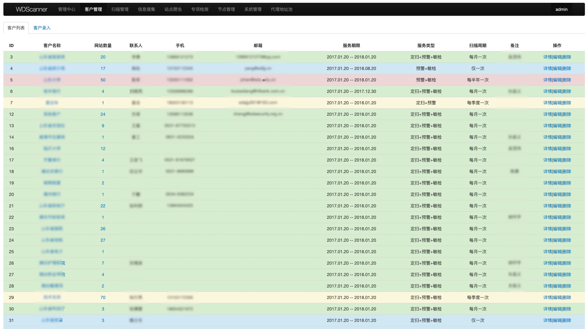

## 4、网站信息收集
在添加新任务后，后台可主动识别目标banner和操作系统信息、端口开放、敏感文件扫描等。

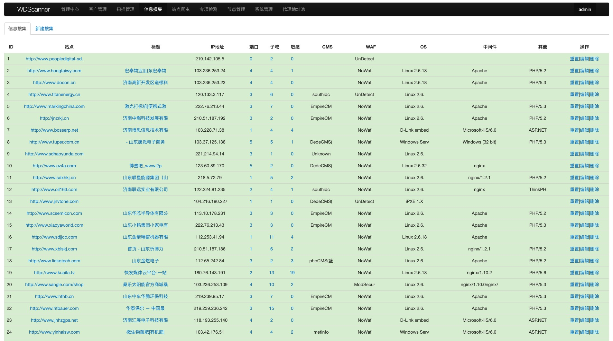


自动识别开发语言、WAF、CMS和中间件等，并对常见端口进行扫描并判断其服务。

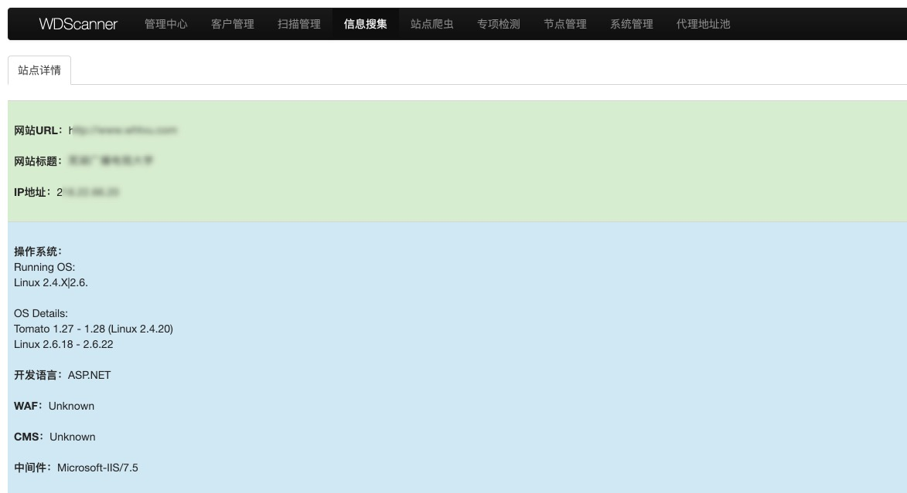

子域名的搜集使用了暴力枚举和互联网检索两种方式，保证了子域名的可用性并缩短了检索时间。


## 5、网站爬虫
目前政府类网站对暗链、敏感字和坏链等内容比较敏感，而网站爬虫可较好的解决这部分需求。

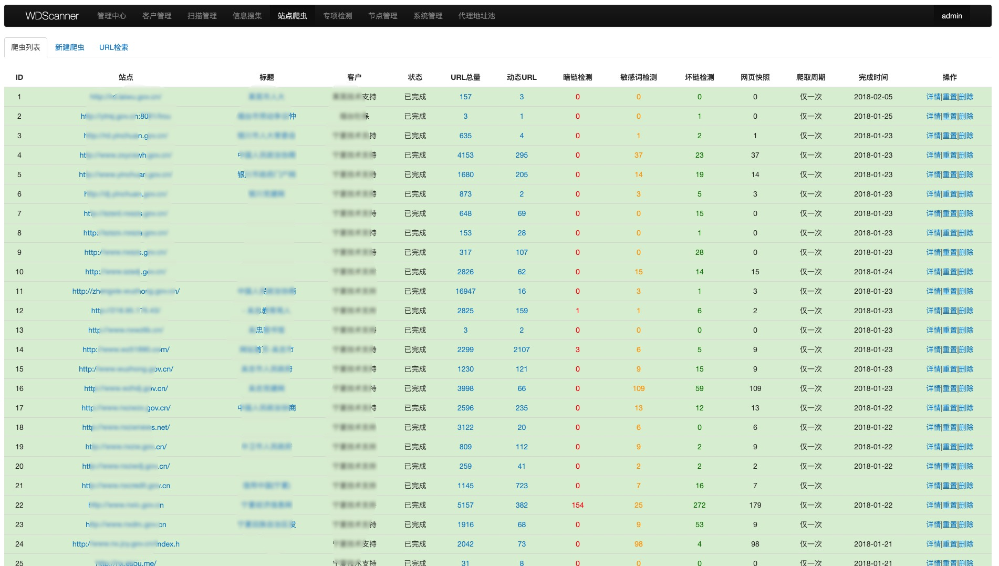

网站爬虫主要是周期性对目标整站页面进行爬取，爬虫算法主要采用了宽度优先遍历策略，可进行网页链接搜集、动态URL搜集、网站敏感字检索、暗链检索、坏链检测、存储网页快照等。

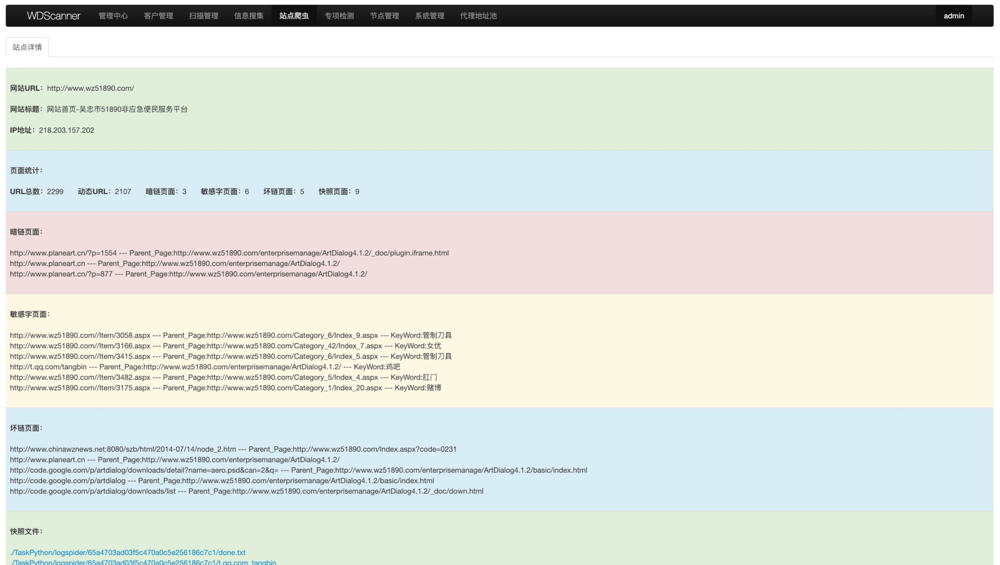


## 6、专项检测
WDScanner集成了专项漏洞检测功能，可在发生高危漏洞时快速部署检测POC，对客户网站进行批量安全性检测。

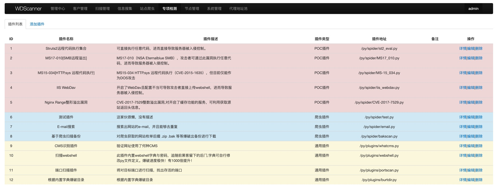


## 7、检索中心
检索中心可使用关键字对漏洞扫描、信息搜集、网站爬虫等进行检索，如漏洞类型、操作系统类型、开放端口、中间件类型、开发技术等。

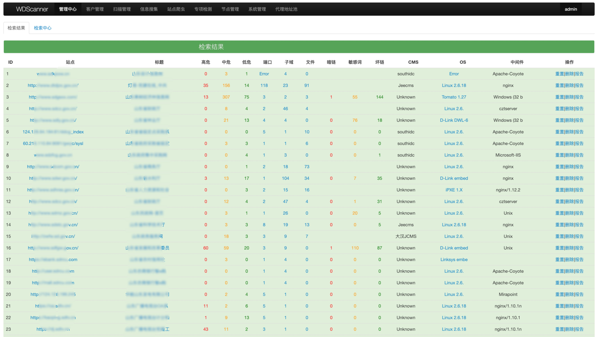


网站URL检索，以检索包含.action的URL为例。

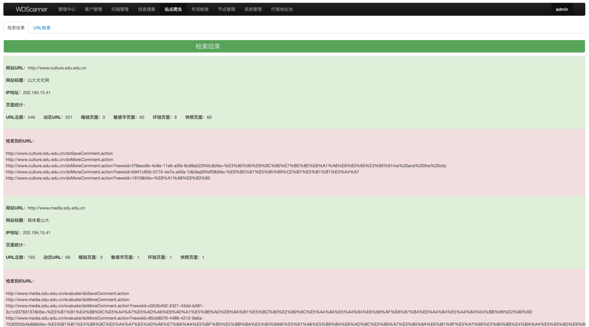

## 8、代理资源池

内置了代理资源池功能，对搜集到的代理地址的可用性进行动态打分排序，可以在扫描探测被封ip时智能切换IP地址。

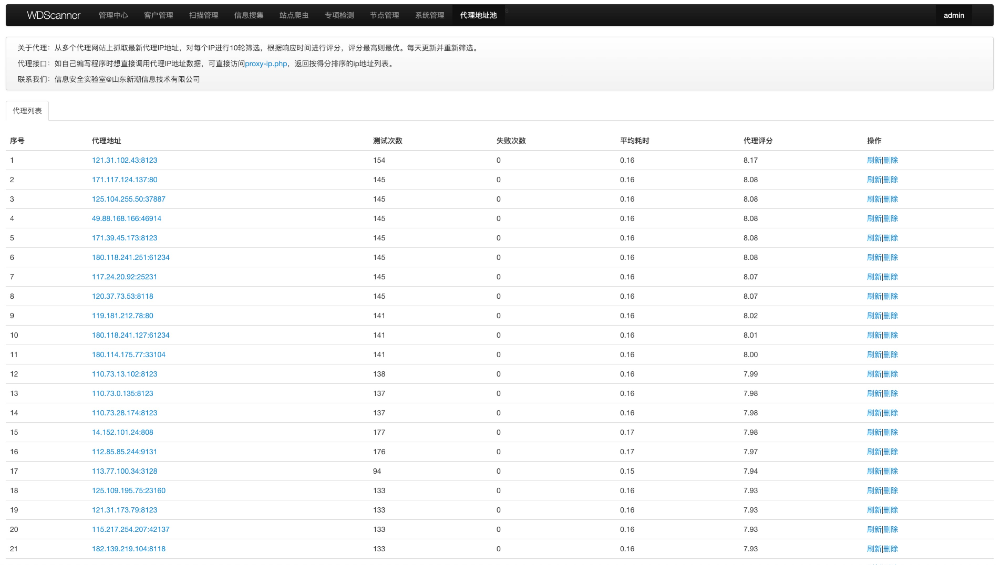

## 9、节点管理

对扫描节点进行管理，不在范围内的节点无法请求平台任务。


## 10、报告输出

报告输出是专业扫描器不可缺少的部分，看起来功能不是很起眼，但的确花了我们很多时间和精力来实现这个功能。现在还只是实现了一个常规报告模板，而且在漏洞分类里还有些重复，后续还会慢慢完善。

在任务管理里每个任务都可以进行报告导出，大家可以看下报告的大体版式和内容，本想加入图表，暂时没能实现。
生成的报告大体这样。

概述部分：

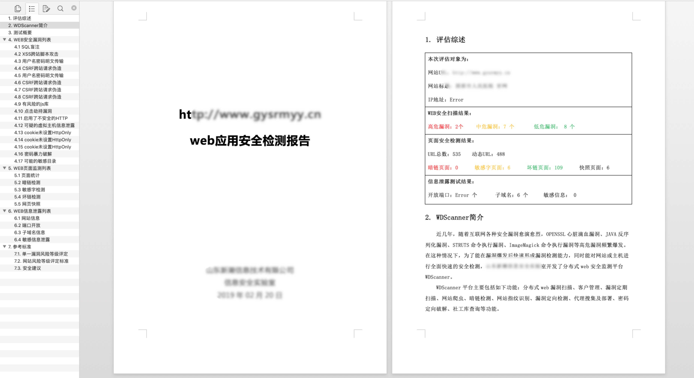

漏洞展示：

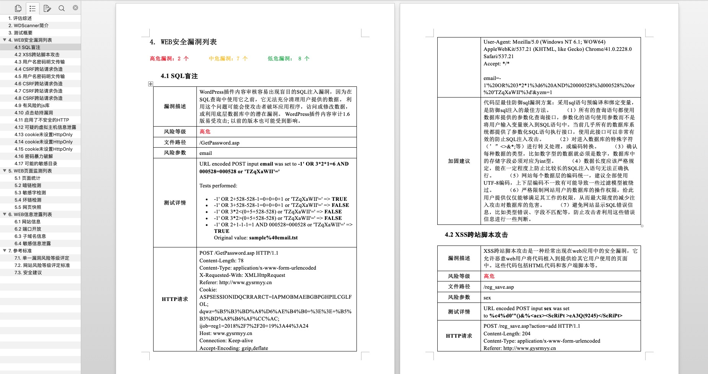

敏感字：

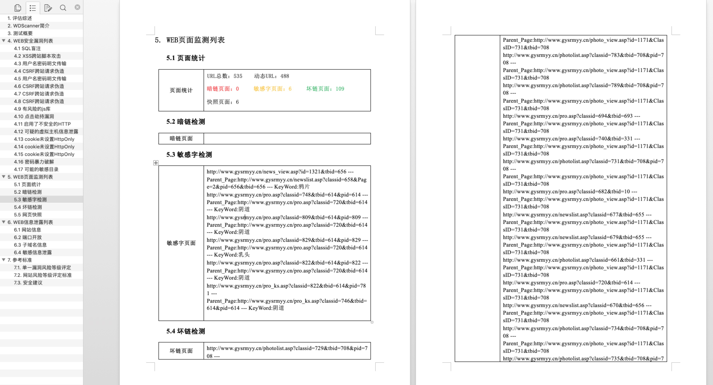

信息泄露：

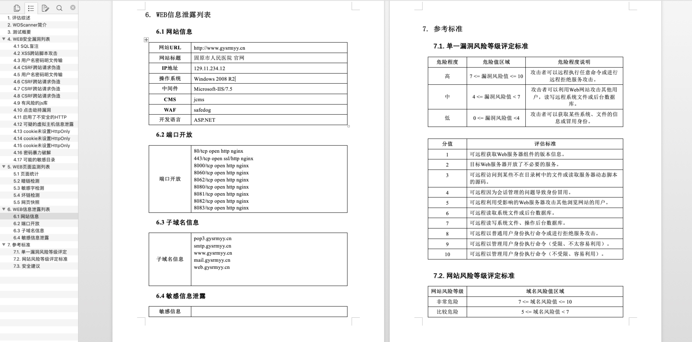

# ToDo

- 前端配色能不那么恶俗；
- 平台是之前开发的，有些代码可能存在bug，不要部署在互联网上；
- 部分功能因为耗时较长，已在代码中注释掉，建议有兴趣的可以进行二次开发。
- 提供的虚拟机镜像为win7 sp1，没打任何补丁，ms17010什么的应该也有，如有必要请自行加固虚拟机。

# 关注我们

**TideSec安全团队：**

Tide安全团队正式成立于2019年1月，是以互联网攻防技术研究为目标的安全团队，目前聚集了十多位专业的安全攻防技术研究人员，专注于网络攻防、Web安全、移动终端、安全开发、IoT/物联网/工控安全等方向。

想了解更多Tide安全团队，请关注团队官网: http://www.TideSec.net 或关注公众号：

<div align=center></div>


